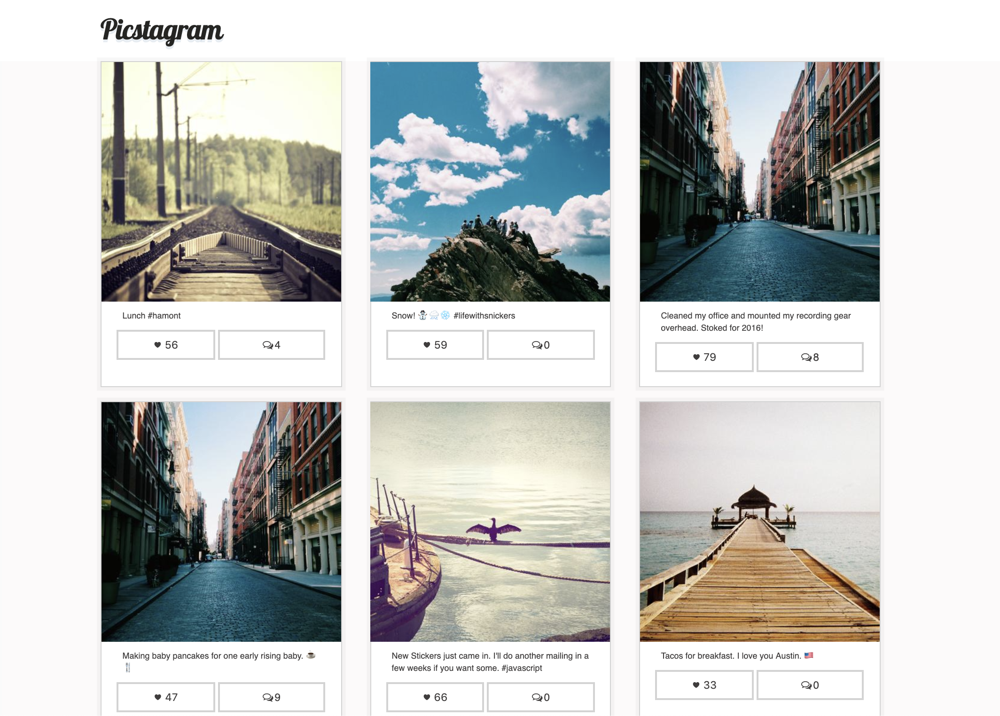
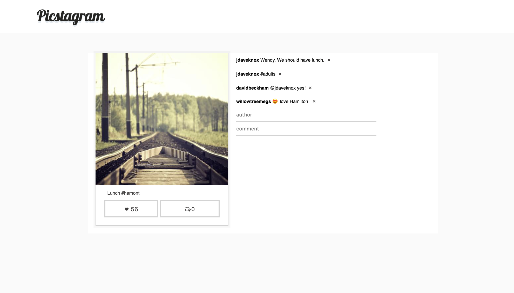

# Picstagram

A simple picture gallery app resembling instagram minimalist-design built using React and Redux.

## Start the development server

Run following commands in terminal:
1. `git clone git@github.com:meghna-saxena/picstagram.git`
2. `cd picstagram`
3. Install dependencies using `npm install` or `yarn install`
4. Run the development environment by `npm start` or `yarn start`
5. Open the app on browser `http://localhost:3000`

## Overview

_Home page:_

- Shows a grid of photos aligned using flexbox.
- Each grid shows the extra info about likes, comments and caption.
- User can increment the likes.

_Photo details page:_

- On clicking any photo from the grid, or while clicking comments icon, user is navigated to photo details page showing the url `localhost:3000/view/:id`

- On this page, user sees the photo on the left - with likes and comments
- User can increment likes
- On right side, a comment section is present showing all the comments.
- User can add a comment by entering `author` and `comment` inputs.
- User can also remove the comment by clicking on the cross button.
________________

#### Screenshots

> Home 

> Photo Details

